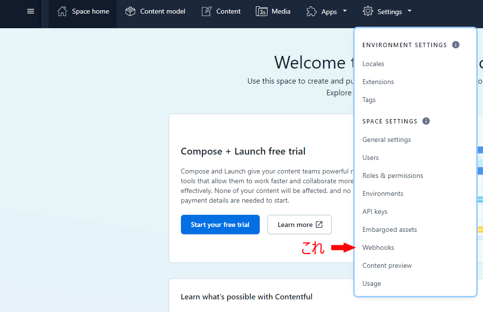
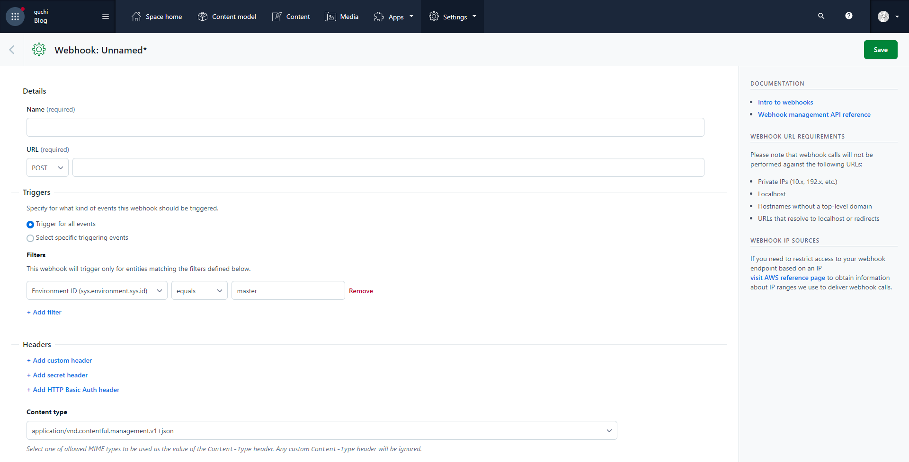
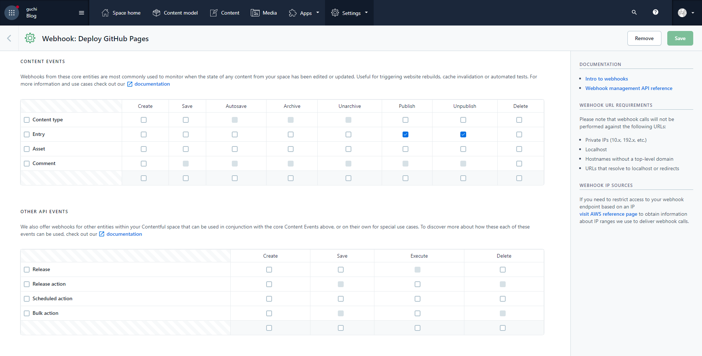
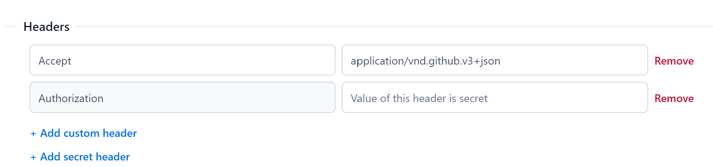

Contentfulのspace内で何かしらイベントが発生した際にWebhookを送ることができるのを利用してGitHub ActionsでGatsby.js製のサイトをビルドするようにしたのでメモ。主にContentfulでのWebhook送信とGitHub Actionsの設定について書きます。

## やること
### GitHub側
#### 1. リポジトリのワークフローファイルの編集
ワークフローをトリガーするイベントにworkflow_dispatchを追加するだけです。
例:

```yml
name: deploy on github pages

on:
  push:
    branches:
      - main
  workflow_dispatch:
```
#### 2. Personal access tokensの取得
[個人アクセストークンを使用する - GitHub Docs](https://docs.github.com/ja/authentication/keeping-your-account-and-data-secure/creating-a-personal-access-token)を参照。アクセストークンは作成後のみ表示されコピーできるのでそのうちに控えておきましょう。Contentful側の設定で使います。その後ページを閉じたりリロードした場合は再度確認することができないようなので注意。わからなくなった場合は作り直す必要があります。

### Contentful側
#### 1. spaceでのWebhookの設定
spaceのSettings > Webhooksを開く。

その後右上のAdd Webhookを選択するとこんな感じのページが表示されます。


##### Name
Contentful上での名前です。何でも大丈夫です。

##### URL
Webhookの送信先です。今回はGitHub Actionsでworkflow_dispatchイベントをトリガーさせるには以下のURLを使います。

```url
https://https://api.github.com/repos/{owner}/{repo}/actions/workflows/{workflow_id}/dispatches
```

([アクション - GitHub Docs](https://docs.github.com/ja/rest/reference/actions#create-a-workflow-dispatch-event))
##### owner
  リポジトリを所有しているアカウントの名前
##### repo
  リポジトリの名前
##### workflow_id
  workflowのIDということになっているがどこで確認できるのかわからなかった。ワークフローのファイル名でもいいということなのでそちらを使いました。

##### Triggers
どんなイベントでWebhookを送信するかを指定します。最初のラジオボタンは`Select specific triggering events`の方を選択します。Entryの公開/非公開で発火させる場合はこんな感じに設定します。

その下のFiltersの設定は必要であれば設定してください。これは特定のContent typeやEntryの場合に発火するように設定できるようです。

##### Headers
AcceptとAuthorizationとUser-Agentを設定します。([REST API のリソース - GitHub Docs](https://docs.github.com/ja/rest/overview/resources-in-the-rest-api))
Acceptヘッダには`application/vnd.github.v3+json`を設定します。注意が必要なのはAuthorizationヘッダですが、アクセストークンが漏れるとまずいので画像の`Add secret header`から追加しましょう。これに`token {取得したPersonal access token}`を設定します。


上の画像には写ってませんがUser-Agentの設定も必要です。これなんと私がこの記事書いてよしPublishや！！と思ってPublishしたら動かなかったので確認したらこれも必要だったということらしいです。ユーザー名またはアプリケーション名しようしてくださいとのことなのでGitHubのユーザー名に設定します。

##### Payload
bodyの設定です。。[アクション - GitHub Docs](https://docs.github.com/ja/rest/reference/actions#create-a-workflow-dispatch-event)を参考にしましょう。JSON形式で記述します。

これでContentful側の設定も終わりです。

一応ワークフローファイル全体も参考までに上げておきます。本当はキャッシュとか効かせるように設定するといいのかな？

```yml
name: deploy on github pages

on:
  push:
    branches:
      - main
  workflow_dispatch:

jobs:
  deploy:
    name: Deploy on Github Pages
    runs-on: ubuntu-latest
    env:
      CONTENTFUL_HOST: cdn.contentful.com
      CONTENTFUL_ACCESS_TOKEN: ${{ secrets.CONTENTFUL_ACCESS_TOKEN }}
      CONTENTFUL_SPACE_ID: ${{ secrets.CONTENTFUL_SPACE_ID }}
      GOOGLE_ANALYTICS_GTAG: ${{ secrets.GOOGLE_ANALYTICS_GTAG }}

    steps:
      - uses: actions/checkout@v2
      - uses: actions/setup-node@v2
        with:
          node-version: "16.9.1"

      - name: Install packages
        run: |
          npm i -g gatsby-cli@3.0.0 yarn@1.22.10
          yarn install

      - name: Build
        run: "gatsby build"

      - name: Deploy on Github Pages
        uses: peaceiris/actions-gh-pages@v3
        with:
          github_token: ${{ secrets.GITHUB_TOKEN }}
          deploy_key: ${{secrets.ACTIONS_DEPLOY_KEY}}
          external_repository: Furafrafrfr/Furafrafrfr.github.io
          publish_branch: main
          publish_dir: ./public
 ```

## 終わりに
GitHub Actionsすごい